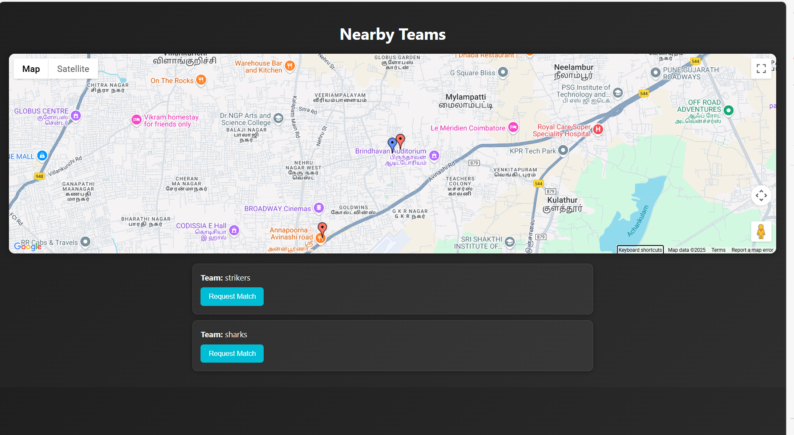

# PlayBuddy 2.0 ⚽🏏

**PlayBuddy** is a location-based sports matchmaking platform that helps players find and challenge nearby teams.

## 🚀 Features
- Create a team with player count and region
- Discover teams within 3–4km
- Send and accept match requests
- Prevent duplicate matches once confirmed

## 🛠️ Tech Stack
- Frontend: HTML, CSS, JavaScript
- Backend: Node.js, Express.js
- Database: MongoDB (with Geospatial Queries)
- Optional: React (Upcoming)

## 🔄 How It Works
1. Team logs in with name & location
2. Views nearby available teams
3. Sends request ➝ gets accepted ➝ match fixed

## 📸 Screenshots

## 📄 License
MIT
